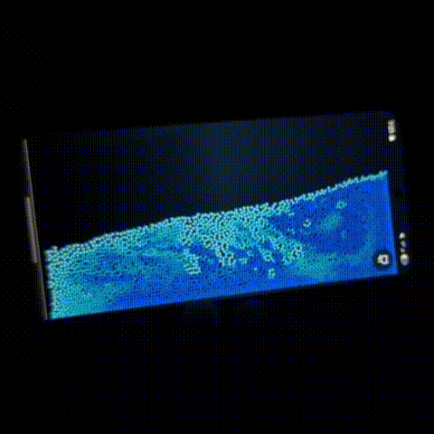

# Flask

A real-time chemistry simulation that runs in your browser and reacts to mobile device sensors. Liquids, gases, and solids that interact with each other. Built using the FLIP (Fluid-Implicit-Particle) technique for realistic fluid dynamics.

**[Try it live at personal-flask-sim.vercel.app](https://personal-flask-sim.vercel.app)**

## Demo



## About

This project implements fluid simulation techniques taught by the amazing [Ten Minute Physics YouTube channel](https://www.youtube.com/channel/UCTG_vrRdKYfrpqCv_WV4eyA), particularly from [this video](https://youtu.be/XmzBREkK8kY).

This was also inspired/forked from [this simulation](https://github.com/shajidhasan/mobile-fluid-sim).

## Todo

- [ ] Add more interaction options
  - [x] Change color with shake
  - [ ] Control flow with finger
- [ ] Add more elements
- [ ] Add more reactions

## Development

```bash
npm install
npm run dev
```

## License

MIT License - see [LICENSE](LICENSE) file for details.

## Contributing

Pull requests are welcome! Feel free to contribute improvements or new features.
